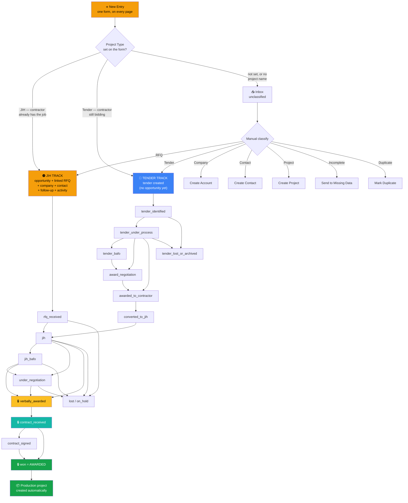
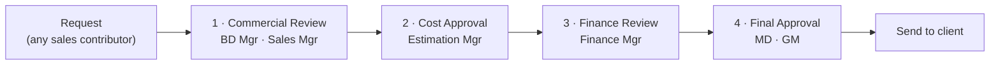

# PHC Command Center — User Guide
### دليل استخدام النظام

> **What this document is.** A complete walkthrough of how work flows through the system,
> from the moment an enquiry arrives to the moment a project is awarded and handed over —
> and what each role is expected to do at each step.
>
> Everything here describes the system **as it actually behaves today**, verified against
> the code and the production database on 2026-08-05. Where the system does not yet do
> something, it says so in [Section 10 — Current Limitations](#10-current-limitations).

---

## Table of contents

1. [The one-minute mental model](#1-the-one-minute-mental-model)
2. [Roles — who can do what](#2-roles--who-can-do-what)
3. [Signing in](#3-signing-in)
4. [The master workflow](#4-the-master-workflow)
5. [Step by step, stage by stage](#5-step-by-step-stage-by-stage)
6. [The Tender track and conversion to JIH](#6-the-tender-track-and-conversion-to-jih)
7. [Page-by-page guide](#7-page-by-page-guide)
8. [Your daily routine by role](#8-your-daily-routine-by-role)
9. [Rules the system enforces](#9-rules-the-system-enforces)
10. [Current limitations](#10-current-limitations)

---

## 1. The one-minute mental model

PHC sells signage packages into construction projects. An enquiry can reach us in one of
two commercial situations, and **the system keeps these two on separate tracks**:

| | **JIH — Job In Hand** | **Tender** |
|---|---|---|
| Situation | The contractor **already has** the project | The contractor is **still bidding** for it |
| Our odds | High — the package is real | Low until the main contract is awarded |
| Lives in | `Opportunities` | `Tender Monitor` |
| Priority | **Higher.** Work these first | Monitor, don't chase |
| Goal | Drive to **Awarded** | Find out who won, then convert to JIH |

Everything else in the system exists to serve that: get enquiries in cleanly, classify
them onto the right track, move JIH opportunities forward one gated step at a time, and
keep tenders from going stale.

**Three ideas worth internalising:**

- **A project is not an opportunity.** One master project (e.g. *KAFD Station A07*) can
  carry several opportunities — one per bidding contractor — each with its own value,
  stage, and quotation history. When the main contract is awarded, only one of them
  becomes the live JIH.
- **Nothing important happens without a record.** Stage moves, approvals, deletions, and
  value changes are all written to history. There is no silent edit.
- **The system asks you for the *next action*, not just the status.** A record with a
  stage but no next action will start nagging you.

---

## 2. Roles — who can do what

There are 11 roles. **A user can hold more than one** — permissions are additive.

| Role | Arabic | Core job |
|---|---|---|
| `system_admin` | مسؤول النظام | Platform, users, imports. **No commercial authority.** |
| `managing_director` | العضو المنتدب | Final commercial sign-off |
| `general_manager` | المدير العام | Final commercial sign-off |
| `sales_manager` | مدير المبيعات | Owns the pipeline, approves stage moves |
| `bd_manager` | مدير التطوير | Business development, commercial review |
| `sales_ops` | عمليات المبيعات | Data quality, pipeline hygiene |
| `finance_manager` | المدير المالي | Values, margins, finance approval |
| `estimation_manager` | مدير التقدير | Cost approval on discounts |
| `salesperson` | مندوب مبيعات | Owns their own deals end to end |
| `viewer` | مطّلع | Read only |
| `ceo` | — | Legacy. Kept only for existing data |

> **Finance and Estimation are one person at PHC — Ahmed Zaid.** The system keeps them
> as separate roles because they answer different questions ("is this above our cost?"
> versus "does this fit our margin?"), and one person can answer both. So the BAFO chain
> below is four steps but **three people**: requester → Zaid (two steps) → executive.

### The permissions that matter day to day

| Action | Who |
|---|---|
| Create records (leads, contacts, RFQs, opportunities, follow-ups) | Everyone except `viewer` and `system_admin` |
| **See other people's deals** | Everyone **except `salesperson`** — a salesperson sees only their own |
| Move an opportunity to Verbally Awarded / Contract Received / Won | `sales_manager` + executives. Others may only **request** it |
| Edit **Total Value** | `finance_manager`, `bd_manager` **only** |
| Edit the **RFQ number** | `sales_manager`, `bd_manager`, `system_admin` **only** |
| Use **Discussion** on an opportunity | `general_manager`, `sales_manager`, `bd_manager`, `system_admin` |
| Assign an owner to a deal | `sales_manager` + executives |
| Execute a delete | `system_admin`, `bd_manager` — **and only after someone else approved it** |
| **BAFO / discount approval (4 steps)** | Each step needs its own business role. **`system_admin` alone can decide none of them** |
| Review AI output | `system_admin` + commercial managers |

> **Note the deliberate split:** `system_admin` can run the platform but **cannot approve a
> commercial decision**. A commercial manager can approve deals but cannot administer the
> platform. This separation is intentional — don't work around it by stacking roles.
>
> Since **2026-08-12** this holds in the database, not only in the interface. `system_admin`
> previously carried an override on all four BAFO steps and on Total Value, so a single
> administrator could approve an entire discount alone. If you hold `system_admin` **and** a
> business role, the authority comes from the business role — and the audit trail records it
> that way.

---

## 3. Signing in

1. Go to the app URL and sign in with your work email.
2. **If you hold `general_manager`, `finance_manager`, `sales_manager`, `system_admin`, or
   `managing_director`, two-factor authentication (TOTP) is mandatory.** On first sign-in
   you'll be sent to MFA setup — scan the QR code with an authenticator app. Every session
   after that requires a code.
3. These same five roles are **signed out automatically after 30 minutes of inactivity.**
4. A new account starts as *pending approval* and cannot see anything until an admin
   activates it.

**Where you land depends on your role:**

- `salesperson` → **My Workspace** (`/my-workspace`) — your personal targets and deals
- Managers, executives, `viewer` → **Command Center** (`/command-center`) — the org-wide view

A salesperson who types the Command Center URL directly is redirected back. This is
deliberate.

**Language:** use the toggle in the top bar to switch between English and العربية. The
entire interface, including right-to-left layout, switches with it.

**Digits stay Western in both languages.** Arabic shows `63,407,478`, not `٦٣٬٤٠٧٬٤٧٨` —
month names, weekday names and currency names are still Arabic, only the numerals are not.
This is deliberate: every document you reconcile a figure against — the ERP, a supplier
quotation, a bank statement, a BOQ line — is written in Western digits, and a number you have
to transliterate before you can compare is a number you will not check. Dates are Gregorian on
both sides of the toggle, so the two languages never name different days for one record.

---

## 4. The master workflow



🔒 = **gated stage.** A salesperson can only *request* it; a commercial manager approves.

**Two things worth reading off that diagram:**

- **The form routes itself.** Setting Project Type and a project name is the whole of
  classification — there is no separate step for a routable entry. The Inbox and its manual
  classify exist for what genuinely can't be routed.
- **The Production project appears at the end, not the start.** It is created automatically
  when an opportunity reaches `won`. Nothing you do at intake creates one, and nothing should.

---

## 5. Step by step, stage by stage

### Step 1 — One form, from anywhere

**Button:** **+ New Entry** in the top bar. It is on every page — you never have to navigate
somewhere first to start.

This is the only entry form in the system. Everything arrives through it: an RFQ, a tender,
a market rumour, a half-captured lead. Fill in what you know — you do **not** need everything
up front. The system assigns an intake number automatically (`INT-2026-0001`); don't type one.

**Two fields decide where it goes:**

| Field | Effect |
|---|---|
| **Project Type** = JIH | Straight onto the JIH track |
| **Project Type** = Tender | Straight onto the Tender track |
| **Project** (name) | Required alongside the type — a type with nothing attached isn't enough to route on |

Everything else is optional and can be filled in later.

> **The single most consequential decision in the system is JIH vs Tender.** Ask one question:
> *does this contractor already have the project?* Yes → **JIH**. No, they're still bidding →
> **Tender**.

**Other useful fields at intake:** Source · Client type · RFQ from · Scope · Location ·
Deadline · **Evidence** (paste the email link, or attach a file — both work) · Assigned owner.

### Step 2 — Save. It goes for review.

**Changed 2026-08-18.** Saving no longer creates the opportunity or the tender
straight away. The request lands in **Opportunity Review** at the top of Intake,
and a **Sales Manager or BD Manager** decides what happens to it. Either one of
them alone is enough — they do not both have to sign.

| Decision | What happens |
|---|---|
| **Approve for Pricing** | Exactly what used to happen on save: a JIH request becomes an opportunity with its RFQ; a tender goes to the Tender board. |
| **Need Information** | Comes back to you with what is missing, who owes it, and by when. Fix it and press **Resubmit** — you do not need a manager to hand it back. |
| **Monitor** | Real, but nothing to do yet. It stays visible and out of the pipeline. |
| **Reject** | Closed, with a reason. The reason is required. |

Everything you type is still one form and one save. The only change is that a
second pair of eyes sees it before it becomes a live deal.

**A reviewer can now correct the request instead of bouncing it back.** Since
**2026-08-25**, opening a row in the queue offers **Edit project details** —
project name, scope, estimated value, deadline, main contractor, consultant and
notes. A wrong deadline or a missing scope no longer costs a round trip through
**Need Information**; use that decision for what only the requester can supply.

The queue's columns are **Project Name · Project Code · Request Type · Deadline
· Status**. Project code is the same number the request carries, now visible
without opening the row — two similarly-named projects were indistinguishable
while scanning. Request type reads **JIH** or **Tender** in the table; the New
Intake form still names the four types in full, because that is where you are
choosing between them.

**Request type now has four options,** not two: JIH · Tender (contractors
bidding) · Tender (government/owner, pre-award) · Unknown. Both tender types go
to the same board — the split tells a contractor you can quote today apart from
a project whose main contract has not been let yet.

### Step 2b — the old behaviour

There is no separate classify step and no separate convert step for a routable entry. Saving
the form does all of it:

**If you set Project Type = JIH** and gave a project name, saving creates in one go:

- the **opportunity** at `rfq_received`
- the **RFQ**, linked to that opportunity
- the **company** and **contact** (matched to existing records where they exist, created where they don't)
- a **follow-up** three days out
- the first **activity log** entry

…and takes you straight to the **opportunity page**.

**If you set Project Type = Tender**, saving creates the tender on the monitoring board and
takes you there. Deliberately **no opportunity** — a tender doesn't count in the JIH pipeline
until the main contract is awarded and it converts.

**If you set neither**, the entry waits in the Inbox as *unclassified* for manual triage. That
is not a failure — it's the right home for a vague market signal or an incomplete capture.

### Editing after it's created

Open the opportunity and use **Edit** on the **Submission** panel. You can change:

- **Deadline** — when the client grants an extension, record it here. Everything that
  chases you about this submission reads that date.
- **Waiting on** — hand the submission to whoever it's actually sitting with. If you need a
  price from Estimation before the quotation can go out, put them here: they get notified,
  and the deal stays yours.
- **Attachment or link** — add the revised RFQ, a drawing, anything that arrived later.
  Uploaded files open in a new tab when you click them; the link is generated at that
  moment and is not stored, so nothing you attach today stops working next week.
- **Notes** — anything worth saying about this submission.

The RFQ number, the company and the contact are not editable here. Those identify the
record; changing them would make it a different record.

### Your RFQ number carries your code

Numbers look like **`FA-26-0001`** — your code, the year, the sequence. The code comes from
your profile, so a number tells you whose deal it is without opening it. Ask an admin if
yours is wrong or missing.

### Step 3 — Manual classify and convert (only for what didn't route)

**Page:** Lead & Tender Inbox — صندوق العملاء والمناقصات (`/lead-tender-inbox`)

Entries that couldn't route themselves sit here. Open one and classify it:

| Classification | What happens on Convert |
|---|---|
| **RFQ** | Opportunity + linked RFQ → **JIH track** |
| **Tender** | Tender on the monitoring board → **Tender track** |
| **Opportunity candidate** | Held as a lead for qualification, not yet an RFQ |
| **Company** / **Contact** / **Project** | Creates that CRM record only |
| **Signal / watchlist** | Kept for monitoring, no record created |
| **Incomplete** | Sent back to *Missing Data* with a reason |
| **Duplicate** | Linked to the record it duplicates |

**Correcting a wrong classification:** you can re-classify **before** converting. Once an entry
has been converted, the classification is locked — the record it created already exists, and
silently re-pointing the entry would orphan it. If a converted entry went down the wrong track,
tell a manager rather than trying to redo it from the Inbox.

**Dates are validated.** Anything outside a sensible range is rejected before saving, with the
message *"That date is too far in the future — check the year"*. A mistyped year can no longer
hide a record from the deadline queue.

### Step 4 — Work the JIH stages

Open the opportunity. Use **Advance Stage** to move it. The system only offers legal next
steps — you cannot skip backwards or jump illegally.

| Stage | Arabic | Means | Required to enter |
|---|---|---|---|
| `rfq_received` | استُلم الطلب | Enquiry logged, not yet worked | — |
| `jih` | فرصة قائمة | Live opportunity being priced | — |
| `jih_bafo` | BAFO الفرصة | Best-and-final pricing round | — |
| `under_negotiation` | تفاوض | Commercial negotiation | **A note or evidence** |
| `verbally_awarded` 🔒 | ترسية شفهية | Verbally confirmed, no paper yet | Contact **name**, contact **title**, **expected contract date**, and **evidence** |
| `contract_received` 🔒 | استُلم العقد | Contract/PO in hand | **Contract value** + **a document or evidence** |
| `contract_signed` | عقد موقّع | Signed by both parties | — |
| `won` 🔒 | مُرسّى | **Officially awarded** | Manager approval |
| `lost` | خسارة | Closed lost | **Loss reason is mandatory** |
| `on_hold` | معلّق | Paused | **Hold reason + review date** |

**Legal moves:**

```
rfq_received      → jih · lost · on_hold
jih               → jih_bafo · under_negotiation · verbally_awarded · lost · on_hold
jih_bafo          → under_negotiation · verbally_awarded · lost · on_hold
under_negotiation → verbally_awarded · lost · on_hold
verbally_awarded  → contract_received · lost · on_hold
contract_received → contract_signed · won · on_hold
contract_signed   → won · on_hold
on_hold           → back to any active stage
won / lost        → terminal
```

Stages **can** be skipped where business reality demands it — `jih` straight to
`verbally_awarded` is allowed. Every move, skipped or not, is written to stage history.

### Step 5 — What "gated" actually means

When a salesperson tries to move a deal to `verbally_awarded`, `contract_received`, or
`won`:

1. The system **does not** move the stage.
2. It creates an **approval request** carrying your full payload.
3. The opportunity is flagged *action required*.
4. A commercial manager opens **Approvals** and decides.
5. On approval, the system applies the stage move **exactly as you submitted it**.

A commercial manager doing the same move applies it directly. Nothing is lost either way —
the request is stored, not re-typed.

### Step 6 — Quotations and revisions

Every quotation is a record with a version. **Revising never overwrites.**

`reviseQuotation` creates a **new row** at `version + 1` and marks the previous one
`revised`. The full commercial history — original → Rev 01 → Rev 02 → BAFO → final —
stays intact and readable on the opportunity.

Never edit an old quotation's value to "correct" it. Revise it.

### Step 7 — BAFO / discount approval chain

When a discount needs authority, raise a **BAFO request** from the opportunity's BAFO
panel. It moves through **four sequential approvals**:



The order is enforced by the database. Step 3 cannot happen before step 2.

Steps 2 and 3 are both Ahmed Zaid, who holds Finance and Estimation. The independent
check is step 4.

### Step 8 — Award and handover

Once at `won`, the opportunity:

- counts toward the **awarded total** and target achievement,
- leaves the active JIH pipeline,
- gets `handover_status = pending`,
- appears in the **Award & Contract Queue** awaiting handover to Production.

**Only `won` counts as awarded.** Verbally awarded, contract received, and contract signed
do **not** contribute to the annual target — by design.

---

## 6. The Tender track and conversion to JIH

**Page:** Tender Monitor — مراقب المناقصات (`/tenders`)

A tender is *monitored*, not chased. Record the bidding contractors under
**Tender Contractors** with a win-likelihood for each.

**Tender stages:**

```
tender_identified      → tender_under_process · archived
tender_under_process   → tender_bafo · award_negotiation · awarded_to_contractor · archived
tender_bafo            → award_negotiation · awarded_to_contractor · archived
award_negotiation      → awarded_to_contractor · archived
awarded_to_contractor  → converted_to_jih · archived
```

**Tender BAFO** is for a best-and-final round on the tender itself. It is optional —
go straight to Award Negotiation when there isn't one.

### When the main contract is awarded

**Page:** Tender Conversion — تحويل المناقصات (`/tender-conversion`)

Move the tender to `awarded_to_contractor`, then **request conversion**. A commercial
manager approves it. On approval a JIH opportunity is created and linked back to the tender.

Two outcomes:

- **The contractor we were already quoting won** → convert this tender to JIH.
- **A different contractor won** → create a linked JIH for the *winning* contractor and
  approach them for a fresh RFQ. The original tender record is kept, not deleted.

Either way the original RFQ, quotation versions, activity history, and bidder information
are preserved.

### The 90-day rule

A tender with no result **90 days** after its submission date (or received date, if never
submitted) is flagged for **conversion review**. When you see that flag, answer:

- Has the main contract been awarded? To whom?
- Is our bidder still in the competition?
- Convert to JIH, keep monitoring, or close as dormant/lost/cancelled?

Old tenders are not allowed to sit active forever.

---

## 7. Page-by-page guide

### Home — الرئيسية

| Page | Use it for |
|---|---|
| **Command Center** `/command-center` | Org-wide executive view. Opens with **Sales performance** — open pipeline, weighted forecast, Won, late-stage exposure, win/loss rate. Every tile shows the formula it used and opens the exact records behind the number. The ⓘ on a tile explains the number without opening it; the rest of the tile opens the records. Every figure is computed over **the whole book you are permitted to see** — if the dataset were ever too large to read in one go, a warning appears above the figures saying so, and you should not treat them as totals until it clears. Below it: pipeline by stage, follow-up distribution, RFQ status, team target, items needing attention. |
| **My Workspace** `/my-workspace` | Your personal command centre. Opens with **What needs you today** — one ranked list of your highest-priority work drawn from every queue. Below it, the dashboard your role already had: target gauge, awarded vs remaining, JIH and Tender totals, urgent follow-ups and submissions. **A salesperson's home base.** |
| **Action Required** `/action-center` | Your work queue — now covering **all five sources**: the automation queue, tasks, follow-ups, approvals, and intake reviews. Filter by Mine / Team / All, Overdue / Due today / Upcoming, plus type, record type, priority and owner. Every row says *why* it is there. Managers also get the **Run Automations** button. |
| **Approvals** `/approvals` | One decision desk for all three approval workflows: **intake review**, the **BAFO chain** (showing which of the four steps is waiting and on which role), and record approvals — verbal award, contract, won, deletion, sure-win. |
| **Calendar** `/calendar` | Everything that carries a date, on one month grid: follow-ups due, RFQ response deadlines, and next actions on open deals. Each day shows a dot per item — red for overdue, amber for today — and opens a panel listing them. **New follow-up** creates one through the same path the rest of the app uses, so it also appears in Action Required and Follow-ups; there is no second task list to reconcile. Undated work does not appear at all: the calendar arranges dates, it never invents one. Closed deals and completed follow-ups drop off rather than sitting greyed out, so nothing on the grid is safe to skim past. |
| **Notifications** (bell) | Opens the drawer, not a page. Shows **what happened**: unread count on the bell, mark-one/mark-all read, dismiss, and a deep link to the record. Distinct from actions — see Section 7b. |

### 7a. What counts as a sale

Three numbers get confused constantly, so the system keeps them apart:

| | What it means | Counts toward target? |
|---|---|---|
| **Won** | `sales_stage = won`. The deal is ours. | **Yes — only this** |
| **Late-stage exposure** | Verbally awarded, contract received, contract signed. | **No.** These can still be lost |
| **Weighted forecast** | Open pipeline × probability | **No.** An estimate, not money |

**Win rate is Won ÷ (Won + Lost).** Open deals are not in the denominator, and it
is never calculated from quotations. If nothing has closed yet the system says so
rather than showing 0%.

**Probability** comes from the manager's number when one is recorded, and from AI
only when it is not — labelled "AI-estimated" so you always know which you are
looking at. The two are shown side by side and never averaged. A deal nobody has
scored is reported as **Unscored** and left out of the forecast entirely.

### 7b. Actions vs notifications — they are not the same thing

The two are easy to confuse, and the system treats them differently on purpose.

| | Action | Notification |
|---|---|---|
| Answers | *What do I need to do?* | *What happened?* |
| Lives in | Action Center, My Workspace | The bell drawer |
| Lifecycle | Open → in progress → done / dismissed | Unread → read → dismissed |
| Disappears when | The underlying work is finished | You read or dismiss it |

**You will not be notified twice about the same thing.** A notification is raised
once per *occurrence*, not once per day. An item that stays overdue for a month
notifies you the day it goes late and then stays quiet. You get a fresh one only
when something genuinely changes: a new stage, a new decision, a new assignee, a
resubmission, or a due date that moved and then passed again.

You are also never notified about your own action — moving your own opportunity
to the next stage does not ping you about it.

**Overdue alerts** arrive from the nightly automation run (07:00 Riyadh), the same
job that fills the Action Center. Only tier A and B items raise one — tier C would
be noise — and only if they lapsed within the last week, so switching this on does
not dredge up work that went late months ago.

### Sales — المبيعات

Four destinations, and only four. As of **2026-08-12** this group is the whole of Sales.

| Page | Use it for |
|---|---|
| **Intake** `/lead-tender-inbox` | The triage queue for entries that couldn't route themselves. Classify and convert them here. Entries with a project type and name never appear — they went straight to their track. |
| **Opportunities** `/opportunities` | Every JIH opportunity. Card or table view, filter by stage and tier. Arriving from a dashboard number also scopes the list by **salesperson** and **period** — neither has a dropdown here, so a bar above the list names every filter that is active, and **Clear filters** removes all of them, including the two that arrived in the link. Since **2026-08-25** the strip at the top reads **Target sales · Sales achievement · Need to close · Pending for submission**, with a second row for **Sales project status** — verbally awarded, JIH, tenders, and how many of each are still to be submitted. Every tile explains its own formula and links to the exact records behind it. |
| **Tender Monitor** `/tenders` | Every tender, with urgency KPIs and age tracking. |
| **Awarded Projects** | Not a separate page — the Opportunities list filtered to **awarded**. Since **2026-08-25** that means verbally awarded, contract received, contract signed *and* won — the four stages an awarded JIH passes through. It previously filtered to `won` alone and showed "No results" for work the team had already won. |

> **Inbox, Opportunities and Quotations used to show each other as tabs.** That strip is
> gone. Each page is now one thing, which is the point of the cleanup.

### Pages that left the sidebar — and still work

Nothing was deleted. These keep their data and their URLs; they are reachable by direct
link, by bookmark, and from **⌘K** search. They left the sidebar because they are a view
of something else, an action inside a record, or they belong to a section not built yet.

| Page | Where it went |
|---|---|
| **Quotations** `/quotations` | Moves to Commercial & Finance when that section exists. Until then: ⌘K or the direct link. All three tabs (Quotations, RFQ & JIH, BOQ) still work. |
| **Follow-ups** `/follow-ups` | A follow-up is an action on a record. It appears in My Workspace, on the opportunity, and in Action Required. Also in the header's quick-actions menu. |
| **Targets** `/targets` | The number belongs next to the work it judges — My Workspace, Command Center, Admin Settings. |
| **Award & Contract Queue** `/award-queue` | Replaced in the sidebar by **Awarded Projects**, the filtered Opportunities view. The page itself still works. |
| **Tender Conversion** `/tender-conversion` | Becomes an action inside the tender. The queue page still works. |
| **AI Agents / Agent Activity** | Now **AI Configuration** and **AI Audit**, under the collapsed Admin group. |

### CRM — إدارة العلاقات

| Page | Use it for |
|---|---|
| **Accounts** `/accounts` | Companies. Each account page shows contacts, active opportunities, pipeline, and a **relationship-health AI panel**. You can start a **New Opportunity** straight from an account — no need to go through Intake for an existing client. |
| **Contacts** `/contacts` | People, with authority level, confidence, and communication history. Six columns that fit one screen — no sideways scrolling — with call, email and WhatsApp as icons on every row; anything longer is on the row you open. Each row also carries the standard lifecycle menu, so a contact can be **deleted** through the same approval-backed path as any other record. |
| **Repair contacts** `/contacts/repair` | Only useful if an import damaged your contacts. Proposes a corrected name, title, phone and email for each broken row and shows you the reason for every change. Nothing is written until you press Save, and rows it cannot read confidently are left for you rather than guessed at. See Section 10. |

### Production — الإنتاج

| Page | Use it for |
|---|---|
| **Projects** `/projects` | Project dashboards. Auto `PRJ-2026-0001` numbering, cover image, **Job Pipeline** (a Kanban whose columns *you* define — add, rename, reorder), and **Budget** line items. Shows every linked opportunity with its contractor, package status, and BOQ status — this is where multi-contractor projects become readable. |

A project is created automatically when an opportunity is won. A second win on the same
project does **not** create a duplicate.

### Reports & Analysis — التقارير والتحليل

| Page | Use it for |
|---|---|
| **Reports** `/reports` | Pipeline by stage, quotation funnel, loss reasons, plus an **AI Weekly Report**. |
| **Targets & Performance** `/targets` | Set and track targets. Salesperson and manager metric views. |

### Resources — الموارد

| Page | Use it for |
|---|---|
| **Knowledge Search** `/knowledge` | Semantic search across indexed project knowledge. |
| **Reference Library** `/reference-library` | Past PHC project references for proposals. |
| **Vendors** `/vendors` | Supplier records. Pricing and internal ratings are restricted. |
| **Project Radar** `/discovery` | Early market signals before an RFQ exists. |

### Admin — الإدارة

| Page | Use it for |
|---|---|
| **AI Agents** `/ai-agents` | The registry of all 18 AI agents. |
| **Agent Activity** `/agent-activity` | Every AI run and output, with accept/reject review. |
| **Data Import** `/data-import` | *(admin only)* Spreadsheet import: map columns → preview → validate → error report → commit. |
| **Admin Settings** `/admin-settings` | *(admin only)* Users, roles, status. |
| **Settings** `/settings` | Your own profile, language, MFA. |

### Finding anything fast — ⌘K

Press **⌘K** (or **Ctrl+K**) anywhere in the app to open search. Type two characters or more
and it looks across **opportunities, projects, accounts and contacts** as well as page names,
in Arabic or English. Pick a result and it takes you straight to that record.

Contacts have no page of their own, so a contact hit opens the Contacts list already filtered
to that name — the address bar shows `\u200E/contacts?q=…`, which you can bookmark or send to someone.

With the box empty you get your pinned and recently opened records instead. If nothing matches,
it says so.

### Inside an opportunity

The opportunity page is one long timeline you can filter by facet:
**All · Alert · Evidence · Decision · Assignment · Follow-up · Outcome.**

**Client Details is editable, JIH-or-Tender included.** Until **2026-08-25** the
card displayed **JIH or Tender** but the Edit dialog did not offer it, so a
record that plainly is a JIH stayed on "—" with no way to say otherwise. The
value lives on the RFQ — the same one the Opportunities list's JIH/Tender column
reads — and an opportunity that has no RFQ yet gets one created when you set it,
holding nothing but the answer you gave.

Panels you'll use: Alert, Client Details (editable), Qualification, Assignment, Technical
Notes, **Milestone Checklist** (7 fixed items, independent of stage), Evidence Sources,
Follow-ups, Approvals, **Discussion** (with @mentions that create a real approval request),
Contract Stage, Scoring, AI Risk Assessment, AI Opportunity Evaluation, BAFO, and
Communication History.

### AI, everywhere

Look for the ✨ icon. Every main page has at least one AI touchpoint — commercial risk on
RFQs, tenders, quotations and accounts; job notes on the project pipeline; budget variance;
report insights; follow-up drafting.

All 18 agents run through a single governed backend service. **AI never writes to a record
on its own** — it proposes, you apply.

---

## 8. Your daily routine by role

### Salesperson — مندوب مبيعات

1. Open **My Workspace**. Check the target gauge and what's overdue.
2. Work **Urgent Follow-ups** top down. Log the outcome — don't just reschedule.
3. Check **Urgent Quotation Submissions** for anything due within 7 days. It shows the
   submission's real status (not started / in progress / submitted) and who it's waiting on,
   so you can tell at a glance what needs chasing and who to chase. Click a row to open it.
4. Clear **Action Required**.
5. For every JIH deal, confirm the **next action** field is filled. Empty next action = the
   system will flag it.
6. Request gated stage moves early — approval takes time.

**When an RFQ lands in your email:** hit **+ New Entry** from wherever you are, set Project
Type and the project name, paste the email link into Evidence, save. You'll be on the
opportunity page with the follow-up already scheduled. Don't go looking for the Inbox first.

### Sales Manager — مدير المبيعات

1. Open **Command Center** for the org-wide position.
2. Clear **Approvals** first — your team is blocked behind them.
3. Work **Award & Contract Queue**: verbal awards with no contract, contracts with no reference.
4. Check **Tender Conversion** for anything past 90 days.
5. Run **Automations** from Action Center *(until it is scheduled — see Limitations)*.
6. Review AI outputs in **Agent Activity**.

### BD Manager / Sales Ops — التطوير والعمليات

1. Clear the **Inbox** — nothing should sit `unclassified` overnight.
2. Chase *Missing Data* items.
3. Resolve duplicates.
4. Keep Accounts and Contacts clean; verify contact authority.
5. Handle the commercial-review step on BAFO requests.

### Estimation Manager / Finance Manager

- **Estimation:** cost approval on BAFO requests; BOQ verification.
- **Finance:** finance approval on BAFO; you are one of only three roles that can set
  **Total Value**.

### General Manager / Managing Director

1. **Command Center** — target, pipeline, what needs a decision.
2. Final approval on BAFO requests.
3. Approve `won` — this is the moment revenue is recognised in the system.
4. **Reports** and the AI Weekly Report.

### System Admin

1. **Admin Settings** — approve pending users, assign roles.
2. **Data Import** — always preview and read the error report before committing.
3. Monitor **Agent Activity** for failures.
4. Remember: you administer, you do **not** approve commercial decisions.

---

## 9. Rules the system enforces

These are guardrails, not suggestions. They will stop you.

1. **Two-person deletion.** Nobody deletes alone. A commercial manager approves; `system_admin`
   or `bd_manager` executes. Records are archived, not erased.
2. **Gated stages.** Verbal award, contract received, and won always require commercial
   authority.
3. **Evidence before award.** No verbal award without a named contact, title, expected
   contract date, and evidence. No contract stage without a value and a document.
4. **Mandatory loss reason.** A deal cannot be closed lost without one.
5. **Four-step BAFO chain**, enforced in order at database level.
6. **Salesperson data isolation.** A salesperson sees only their own deals — enforced by
   row-level security, not just the interface.
7. **MFA for decision-makers**, plus 30-minute idle logout.
8. **Separation of technical and commercial authority.** `system_admin` has no commercial
   sign-off.
9. **Quotation history is immutable.** Revisions add versions; they never overwrite.
10. **Human-in-the-loop AI.** Agents propose. People apply.
11. **Only `won` is awarded.** Nothing earlier counts toward the target.
12. **Dry-run imports.** Preview and error report before any data is committed.

---

## 10. Current limitations

Verified against production on **2026-08-06**. Read this before trusting a number on screen.

### What is actually in production
Verified live on **2026-08-27**: the book holds **49 opportunities**, and the Executive Brief
computes **SAR 63,407,478** across them. This section used to say "2 opportunities, 6 RFQs" —
that stopped being true weeks ago, and a limitations list that overstates how empty the system
is teaches people to distrust figures that are in fact sound.

What is genuinely still missing is the historical **quotation masterlist**, which has never
been migrated. Every dashboard is accurate over the data that is loaded; none of them can show
years the database does not hold.

### The target gauge reads zero
There is no annual target row, no current-month target, and no awarded opportunity. Target,
achievement and remaining all display as zero or blank. **This is missing data, not a broken
calculation** — the arithmetic has been verified. Someone needs to enter an annual target.

Since **2026-08-25** this also drives the top of the Opportunities page. **Target sales** and
**Need to close** show a dash there, not a zero, and the tile says why — "no target has been
set for this period". A dash and a zero are different facts and must not look the same.

### Most opportunities are not classified as JIH or Tender
The **JIH** and **Tender** counts only add up to the open book once every opportunity has been
classified, and most have not — the list's JIH/Tender column is largely dashes. The tiles say
how many are unclassified rather than letting the two figures read as a complete split. Set
the classification from **Client Details → Edit** on the opportunity.

### Dashboard figures are no longer capped
Until **2026-08-26** the Command Center read only the first 200 opportunities (and 100
follow-ups, 400 quotations) before computing open pipeline, forecast, coverage, At Risk,
Needs Attention and Data Quality. Below 200 records that is the whole book and every number
was right; above it the totals would have been quietly short, with nothing on screen saying
so. All of them now read to completion. A ceiling still exists as a safety limit, but
reaching it puts a warning **above** the figures rather than leaving a partial total looking
like a complete one.

### "Decision maker" is answered in one place
The Relationship panel and Data Quality used to consult different fields, so one could report
a decision maker on a deal the other listed as missing one. Both now read the same rule: a
stakeholder holding the role, or the decision-maker name on the opportunity, counts. Where
nobody has recorded a role we can read, the panel says **"cannot tell from the record"** and
Data Quality does **not** list it as missing — an unreadable record is not proof of absence.

### AI commentary on the Executive Brief works — and stays labelled
It was dead from the day it shipped, twice over: the Command Center addressed the AI service
with the wrong entity type, and once that was corrected it read response fields the service
does not return. Both are fixed (PRs #237 and #238) and deployed. `AI INFERENCE` and
`RECOMMENDATION` lines are visible on the brief, kept visually separate from `FACT` and
`CALCULATED`.

**That separation is the whole point.** The deterministic figures did not move when the
commentary started working — SAR 63,407,478 over 49 records, identical before and after.
Commentary is appended to the facts; it never stands in for one.

One rough edge remains: the commentary text is **English even when the interface is Arabic**.

### Reminders now fire on their own
The engine runs **nightly at 07:00 AST**. You no longer have to remember to press anything —
the queue is populated before the sales day starts. A manager can still run it on demand with
**Run Automations** in Action Center; both paths execute the same rules.

Flags are keyed to the *occurrence* that raised them, so the queue does not repeat itself:
dismiss a flag and it stays dismissed while the situation is unchanged. Reschedule the
follow-up and you get a fresh flag, because that is genuinely a new situation.

Still not implemented as rules: submission-deadline countdown reminders (7/5/3/1/0 days)
and the 90-day tender review. Both are calculated for display but never raised as queue items.


### Contact records carry damage from an early import
An early import wrote a person's name, job title, phone number and email into the single
`name` column — which is why the Contacts page showed rows whose other columns were empty
while one column held `Dur Hospitality | Procurement(+966) 11 481 6666 info@dur.sa.`

Of 33 contacts, **26 are now clean**, and **11 email addresses that had been bouncing** were
repaired — several were unusable because import junk had been glued onto the address itself.
**Ten names remain too long or too ambiguous for any rule to split safely.** They are listed
at `/contacts/repair` for a person to confirm. The tool proposes; it never decides.

The cause is fixed at the source, **and that fix is live**: the `import-pipeline` Edge
Function was redeployed on **2026-08-27** (version 34), so imports now separate these fields
before the row is ever written and record what was moved. A new import will not reproduce the
damage. The ten names above are the remaining backlog, not an ongoing leak.

### Files on a record (not yet live)
Opportunities and projects gain a **Files** section. Upload a BOQ, a drawing, a
signed contract or a site photo; each file shows its type, size, date and who
uploaded it. Photos appear as a gallery in the same panel — they are documents
whose type happens to be an image, not a separate album.

Three things worth knowing about how it behaves:

**Replacing rather than re-uploading.** Use the replace button on a file and the
new upload is recorded as its successor. The old version stays and stays
openable; the version list shows the chain. Uploading a second file with the
same name does *not* overwrite the first — it never did since 2026-08-21, and
now the replacement is recorded rather than merely refused.

**Removing hides, it does not destroy.** A removed file stops opening and
disappears from the list, but the record of it — who uploaded it, when, who
removed it — remains. There is no permanent delete in this release. Detaching is
different again: it removes the file from *this* record while leaving it
attached wherever else it belongs.

**Who sees it.** A file is visible to whoever can reach a record it is attached
to. Attach the same file to both an RFQ and its opportunity and both teams see
it; attach it to nothing and only you do.

### Who can open an attachment
Since **2026-08-21**, a file in the attachments bucket is readable only if you uploaded it,
your role handles documents (managing director, general manager, CEO, sales manager, BD
manager, sales ops, finance manager, estimation manager), or you can already see the
opportunity or project it belongs to. Before that date **every signed-in account could read
every file**, including `viewer`.

Two consequences you may notice. A salesperson no longer sees attachments on opportunities
that are not theirs — that is the fix, not a fault. And `system_admin` alone does not grant
access: administering the system is not a reason to read commercial documents, so an admin
who also needs the files needs a second role.

### Two old attachments and one orphan
Files uploaded before this date were stored as a link that expires after seven days, so a few
old ones died quietly. Two were recovered automatically and open again. Three references
could not be recovered and were **not** guessed at: two are Google Drive links (an external
link is not an internal document) and one field holds an email address rather than a file.
They are listed in `document_backfill_report` for someone to sort out. One uploaded file that
no record points at is listed there too — reported, not deleted.

### Records created before 2026-08-06
`RFQ-2026-0001` through `0004` predate the intake rewrite. They have no opportunity attached
and no JIH/Tender classification, because the flow that created them didn't produce those.
They are not broken, just incomplete — a manager can attach them if they still matter.

`RFQ-2026-0001` also carries a deadline in the year 275760, from before date validation
existed. It is invisible to every deadline queue until someone sets the real date.

### The Opportunity Review gate is live
Phase 2's review gate is applied to production — migration
`20260818090000_phase_2_intake_review_gate`, confirmed present in the remote history on
**2026-08-27** (148 local migrations, 148 in production, none pending). Saving a request sends
it for review exactly as Step 2 describes. **The old immediate-conversion behaviour in Step 2b
no longer applies**; read Step 2, not Step 2b.

### Known gaps against the target design
Not yet built: a separate opportunity *condition* field (Dormant / Cancelled), separate
technical and commercial proposal statuses, per-stage win probability,
a dedicated Lost/Cancelled page, and most executive charts (funnel,
pipeline composition, monthly award trend, aging, top opportunities).

### Fixed since the first version of this guide
Listed so nobody works around a problem that no longer exists:

| Was | Now |
|---|---|
| `contract_signed` invisible in the Award & Contract Queue | Fixed — it has its own tab, and a test fails if the stage list drifts again |
| Date fields accepted impossible years | Fixed — out-of-range dates are rejected before saving, in both languages |
| Some opportunities created with no `sales_stage`, invisible to every JIH view | Fixed — every creation path sets it |
| Conversion produced an RFQ but no opportunity | Fixed — conversion produces the opportunity and lands you on it |
| Convert dialog forced you to create a Production project | Removed — the project is created on win |
| "JIH or Tender" and Client Details blank on the opportunity page | Fixed |
| Tender BAFO rejected with a 409 — the stage was unreachable | Fixed — it works, and a test diffs the two transition maps |
| Management pages read the legacy stage, so a verbal award showed as "Quotation" | Fixed — Command Center, Reports and the opportunities list all read the canonical stage |
| Closing a flag re-raised it on the next automation run | Fixed — flags are keyed to the occurrence, so a dismissed one stays dismissed |
| Reminders only appeared when a manager remembered to press a button | Fixed — the engine runs nightly at 07:00 AST |
| Global search (⌘K) found pages and accounts but never opportunities, projects or contacts | Fixed — all four are searchable, and contacts were added |
| Search showed a blank panel when nothing matched, with no message | Fixed — it says "No results found." / "لا نتائج." |
| A bookmark to `/boq` or `/rfq-jih` opened a white screen | Fixed — both land on the matching Quotations tab |
| A failed sign-in showed "Invalid login credentials" in English on the Arabic UI | Fixed — every auth message is bilingual |
| Agent Activity, AI Agents and Data Import were mostly English in Arabic mode | Fixed — the page chrome is translated (agent names and agent-written summaries stay as-is, they are data) |
| The error toast covered the PHC logo in Arabic | Fixed — it now anchors to the side opposite the logo |
| Opening a protected page with an expired session threw the whole page away and rebuilt it, with a visible flash | Fixed — the guard now redirects after the page has settled instead of mid-render |
| AI commentary on the Executive Brief always read "unavailable" | Fixed — two separate contract mismatches (PRs #237, #238); it renders, and stays labelled apart from the facts |
| The **Pipeline Overview** tile on My Workspace pointed at `/pipeline-overview`, a route that never existed | Fixed — it opens the Command Center |
| Dashboard totals silently stopped at the first 200 opportunities | Fixed — reads run to completion, and a ceiling that is hit warns *above* the figures |
| The Contacts table scrolled sideways and most of its columns looked empty | Fixed — six columns that fit one screen; the rest is on the row you open |
| A contact could not be deleted | Fixed — deletion uses the same approval-backed lifecycle menu as every other record |
| Inbox, Opportunities and Quotations each showed the other two as tabs | Fixed — the duplicated strip is gone; each page is one thing |
| My Workspace and the management dashboards could disagree about a deal's stage | Fixed — every view now resolves the same canonical stage |
| A System Administrator could approve all four BAFO steps alone | Fixed — each step needs its own business role, enforced in the database |
| Nothing reviewed a request before it entered the pipeline | Fixed — Opportunity Review gates every request, enforced in the database |
| Picking **JIH BAFO** or **Contract Signed** failed with an error | Fixed — the server rejected two stages the screen offered; both are reachable now |
| Action Center showed only automation flags — tasks, follow-ups, approvals and intake reviews were invisible there | Fixed — one queue over all five sources, with Mine / Team / overdue / priority filters |
| Approvals showed only record approvals; intake reviews and BAFO steps lived elsewhere | Fixed — one decision desk covering all three workflows |
| The **Pipeline Overview** tile on My Workspace led to a page that does not exist | Fixed — it opens the Command Center, and link targets are now checked against the route list at build time |
| Opening the Opportunities list from a dashboard number, then from a different salesperson's number, kept showing the first one's deals | Fixed — the list now re-filters whenever the link's salesperson or period changes |
| A list opened from a dashboard number could not be un-filtered: **Clear filters** left the salesperson and the period applied | Fixed — clearing removes every filter, and a bar now names the ones that arrived in the link |
| The pipeline-by-stage chart counted deals whose stage had to be guessed, without saying so | Fixed — the chart heading shows how many bars rest on an inferred stage |
| The bell counted every open item, so it never reached zero and stopped meaning anything | Fixed — it counts **unread** notifications, and you can mark read or dismiss |
| **The nightly automation stopped raising anything on 2026-08-07 and nobody noticed for two weeks** | Fixed — a rule referenced a flag type that was never added to the database, and the error rolled back the whole run. The Action Center's apparent quiet was a crash, not calm |
| Nothing told you an important item had gone past its due date | Fixed — tier A/B items that lapse raise one notification, once |
| KPIs were computed three different ways, and a deal at JIH BAFO was counted in none of them | Fixed — one canonical engine reading `sales_stage`, so every screen agrees |
| Forecast quietly weighted unscored deals at 20%, inventing pipeline out of nothing | Fixed — unscored deals are excluded and counted separately, never assumed |
| You could not tell where a number came from | Fixed — every KPI shows its formula, source, filters and record count, and clicks through to the records |
| **Awarded Projects** showed "No results" for work the team had just won | Fixed — it filtered to `won` alone, which is the last administrative step of an award. It now covers verbally awarded, contract received, contract signed and won |
| A reviewer who spotted a wrong deadline or a missing scope had to bounce the request back to fix it | Fixed — **Edit project details** in Opportunity Review |
| **JIH or Tender** was shown on the opportunity page but could not be set | Fixed — it is in the Client Details edit dialog, and an opportunity with no RFQ gets one created to hold the answer |
| The Opportunities strip led with **Tier A** and **Win rate**, both structurally stuck at zero | Fixed — target, achievement, need-to-close and the JIH/Tender split replaced them |

---

## Getting help

- Something wrong with a record → tell your Sales Manager or BD Manager.
- Can't get in, or missing a permission → System Admin.
- The number on screen looks wrong → check [Current limitations](#10-current-limitations) first, then report it.

---

*Reflects the system as at 2026-08-27, branch `main` @ `3dd0621` (deployed).
Behaviour verified against source and the test suite (2271 passing), plus a database behaviour suite run against a throwaway Postgres with every migration applied.

**Phase 4 is live** — the notifications migration was applied on 2026-08-20 and the frontend deployed at `6ce2a37`.

**Attachment access isolation is live** — applied and deployed on 2026-08-21 at `ad41ccf` (PR #196).

**The 2026-08-25 client feedback is live** — PR #233, deployed at `b8ce310`.

**Phase 5.1 is live.** Merged as PR #235 and deployed on 2026-08-26 at `538e53b`: the shared
decision-maker rule, uncapped dashboard reads with a visible warning when a ceiling is hit, the
tile ⓘ separated from the drill-down, Sales Execution, Data Quality, and the deterministic
Executive Brief. Its AI commentary was repaired separately (PRs #237 and #238) and is deployed
too. All 148 migrations are applied — 148 local = 148 in production, none pending.

**Phase 6 (Files / Photos / Location) is not yet live.** The Files section, the document
registry and the site-coordinate fields are on a branch; their migrations are not applied.

**The CRM and interface work of 2026-08-27 is live.** PR #241 (the Calendar page, the rebuilt
Contacts table with deletion, the `/contacts/repair` screen, the Lama Sans type scale and one
shared colour vocabulary), plus PR #242 (this guide) and PR #243 (the forbidden-action guard
and the linter in CI). No migration was involved. Both halves were deployed on 2026-08-27 and
verified against the live site:

1. **the frontend**, at `3dd0621` — `/calendar` and `/contacts/repair` resolve, `Lama Sans`
   leads the computed font stack with seven registered faces, and the console is clean; and
2. **the `import-pipeline` Edge Function**, version 34 — so the import-time field separation
   now protects the running system, not just the repository. This is the half that stops the
   contact damage in Section 10 from recurring, and it is deliberately not part of a frontend
   deploy.

Update this file when the workflow changes.*
