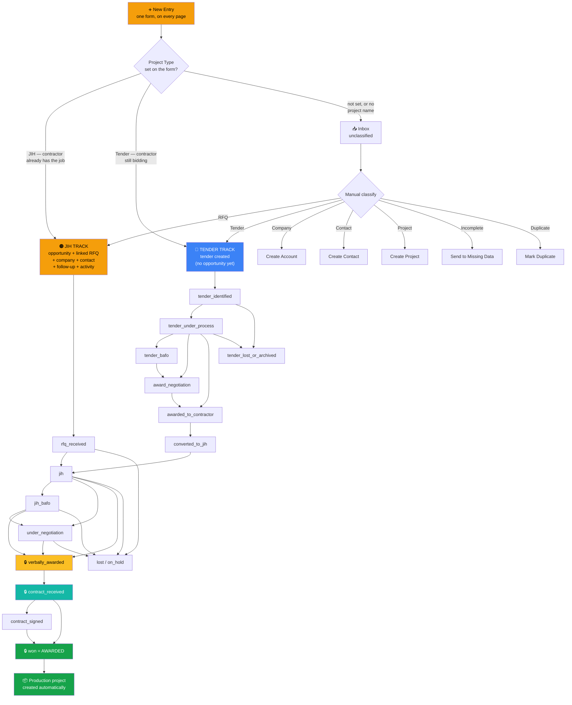
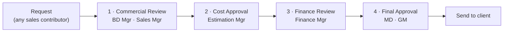

# PHC Command Center — User Guide
### دليل استخدام النظام

> **What this document is.** A complete walkthrough of how work flows through the system,
> from the moment an enquiry arrives to the moment a project is awarded and handed over —
> and what each role is expected to do at each step.
>
> Everything here describes the system **as it actually behaves today**, verified against
> the code and the production database on 2026-08-05. Where the system does not yet do
> something, it says so in [Section 10 — Current Limitations](#10-current-limitations).

---

## Table of contents

1. [The one-minute mental model](#1-the-one-minute-mental-model)
2. [Roles — who can do what](#2-roles--who-can-do-what)
3. [Signing in](#3-signing-in)
4. [The master workflow](#4-the-master-workflow)
5. [Step by step, stage by stage](#5-step-by-step-stage-by-stage)
6. [The Tender track and conversion to JIH](#6-the-tender-track-and-conversion-to-jih)
7. [Page-by-page guide](#7-page-by-page-guide)
8. [Your daily routine by role](#8-your-daily-routine-by-role)
9. [Rules the system enforces](#9-rules-the-system-enforces)
10. [Current limitations](#10-current-limitations)

---

## 1. The one-minute mental model

PHC sells signage packages into construction projects. An enquiry can reach us in one of
two commercial situations, and **the system keeps these two on separate tracks**:

| | **JIH — Job In Hand** | **Tender** |
|---|---|---|
| Situation | The contractor **already has** the project | The contractor is **still bidding** for it |
| Our odds | High — the package is real | Low until the main contract is awarded |
| Lives in | `Opportunities` | `Tender Monitor` |
| Priority | **Higher.** Work these first | Monitor, don't chase |
| Goal | Drive to **Awarded** | Find out who won, then convert to JIH |

Everything else in the system exists to serve that: get enquiries in cleanly, classify
them onto the right track, move JIH opportunities forward one gated step at a time, and
keep tenders from going stale.

**Three ideas worth internalising:**

- **A project is not an opportunity.** One master project (e.g. *KAFD Station A07*) can
  carry several opportunities — one per bidding contractor — each with its own value,
  stage, and quotation history. When the main contract is awarded, only one of them
  becomes the live JIH.
- **Nothing important happens without a record.** Stage moves, approvals, deletions, and
  value changes are all written to history. There is no silent edit.
- **The system asks you for the *next action*, not just the status.** A record with a
  stage but no next action will start nagging you.

---

## 2. Roles — who can do what

There are 11 roles. **A user can hold more than one** — permissions are additive.

| Role | Arabic | Core job |
|---|---|---|
| `system_admin` | مسؤول النظام | Platform, users, imports. **No commercial authority.** |
| `managing_director` | العضو المنتدب | Final commercial sign-off |
| `general_manager` | المدير العام | Final commercial sign-off |
| `sales_manager` | مدير المبيعات | Owns the pipeline, approves stage moves |
| `bd_manager` | مدير التطوير | Business development, commercial review |
| `sales_ops` | عمليات المبيعات | Data quality, pipeline hygiene |
| `finance_manager` | المدير المالي | Values, margins, finance approval |
| `estimation_manager` | مدير التقدير | Cost approval on discounts |
| `salesperson` | مندوب مبيعات | Owns their own deals end to end |
| `viewer` | مطّلع | Read only |
| `ceo` | — | Legacy. Kept only for existing data |

### The permissions that matter day to day

| Action | Who |
|---|---|
| Create records (leads, contacts, RFQs, opportunities, follow-ups) | Everyone except `viewer` and `system_admin` |
| **See other people's deals** | Everyone **except `salesperson`** — a salesperson sees only their own |
| Move an opportunity to Verbally Awarded / Contract Received / Won | `sales_manager` + executives. Others may only **request** it |
| Edit **Total Value** | `finance_manager`, `bd_manager`, `system_admin` **only** |
| Edit the **RFQ number** | `sales_manager`, `bd_manager`, `system_admin` **only** |
| Use **Discussion** on an opportunity | `general_manager`, `sales_manager`, `bd_manager`, `system_admin` |
| Assign an owner to a deal | `sales_manager` + executives |
| Execute a delete | `system_admin`, `bd_manager` — **and only after someone else approved it** |
| Review AI output | `system_admin` + commercial managers |

> **Note the deliberate split:** `system_admin` can run the platform but **cannot approve a
> commercial decision**. A commercial manager can approve deals but cannot administer the
> platform. This separation is intentional — don't work around it by stacking roles.

---

## 3. Signing in

1. Go to the app URL and sign in with your work email.
2. **If you hold `general_manager`, `finance_manager`, `sales_manager`, `system_admin`, or
   `managing_director`, two-factor authentication (TOTP) is mandatory.** On first sign-in
   you'll be sent to MFA setup — scan the QR code with an authenticator app. Every session
   after that requires a code.
3. These same five roles are **signed out automatically after 30 minutes of inactivity.**
4. A new account starts as *pending approval* and cannot see anything until an admin
   activates it.

**Where you land depends on your role:**

- `salesperson` → **My Workspace** (`/my-workspace`) — your personal targets and deals
- Managers, executives, `viewer` → **Command Center** (`/command-center`) — the org-wide view

A salesperson who types the Command Center URL directly is redirected back. This is
deliberate.

**Language:** use the toggle in the top bar to switch between English and العربية. The
entire interface, including right-to-left layout, switches with it.

---

## 4. The master workflow



🔒 = **gated stage.** A salesperson can only *request* it; a commercial manager approves.

**Two things worth reading off that diagram:**

- **The form routes itself.** Setting Project Type and a project name is the whole of
  classification — there is no separate step for a routable entry. The Inbox and its manual
  classify exist for what genuinely can't be routed.
- **The Production project appears at the end, not the start.** It is created automatically
  when an opportunity reaches `won`. Nothing you do at intake creates one, and nothing should.

---

## 5. Step by step, stage by stage

### Step 1 — One form, from anywhere

**Button:** **+ New Entry** in the top bar. It is on every page — you never have to navigate
somewhere first to start.

This is the only entry form in the system. Everything arrives through it: an RFQ, a tender,
a market rumour, a half-captured lead. Fill in what you know — you do **not** need everything
up front. The system assigns an intake number automatically (`INT-2026-0001`); don't type one.

**Two fields decide where it goes:**

| Field | Effect |
|---|---|
| **Project Type** = JIH | Straight onto the JIH track |
| **Project Type** = Tender | Straight onto the Tender track |
| **Project** (name) | Required alongside the type — a type with nothing attached isn't enough to route on |

Everything else is optional and can be filled in later.

> **The single most consequential decision in the system is JIH vs Tender.** Ask one question:
> *does this contractor already have the project?* Yes → **JIH**. No, they're still bidding →
> **Tender**.

**Other useful fields at intake:** Source · Client type · RFQ from · Scope · Location ·
Deadline · **Evidence** (paste the email link, or attach a file — both work) · Assigned owner.

### Step 2 — Save. That's it.

There is no separate classify step and no separate convert step for a routable entry. Saving
the form does all of it:

**If you set Project Type = JIH** and gave a project name, saving creates in one go:

- the **opportunity** at `rfq_received`
- the **RFQ**, linked to that opportunity
- the **company** and **contact** (matched to existing records where they exist, created where they don't)
- a **follow-up** three days out
- the first **activity log** entry

…and takes you straight to the **opportunity page**.

**If you set Project Type = Tender**, saving creates the tender on the monitoring board and
takes you there. Deliberately **no opportunity** — a tender doesn't count in the JIH pipeline
until the main contract is awarded and it converts.

**If you set neither**, the entry waits in the Inbox as *unclassified* for manual triage. That
is not a failure — it's the right home for a vague market signal or an incomplete capture.

### Step 3 — Manual classify and convert (only for what didn't route)

**Page:** Lead & Tender Inbox — صندوق العملاء والمناقصات (`/lead-tender-inbox`)

Entries that couldn't route themselves sit here. Open one and classify it:

| Classification | What happens on Convert |
|---|---|
| **RFQ** | Opportunity + linked RFQ → **JIH track** |
| **Tender** | Tender on the monitoring board → **Tender track** |
| **Opportunity candidate** | Held as a lead for qualification, not yet an RFQ |
| **Company** / **Contact** / **Project** | Creates that CRM record only |
| **Signal / watchlist** | Kept for monitoring, no record created |
| **Incomplete** | Sent back to *Missing Data* with a reason |
| **Duplicate** | Linked to the record it duplicates |

**Correcting a wrong classification:** you can re-classify **before** converting. Once an entry
has been converted, the classification is locked — the record it created already exists, and
silently re-pointing the entry would orphan it. If a converted entry went down the wrong track,
tell a manager rather than trying to redo it from the Inbox.

**Dates are validated.** Anything outside a sensible range is rejected before saving, with the
message *"That date is too far in the future — check the year"*. A mistyped year can no longer
hide a record from the deadline queue.

### Step 4 — Work the JIH stages

Open the opportunity. Use **Advance Stage** to move it. The system only offers legal next
steps — you cannot skip backwards or jump illegally.

| Stage | Arabic | Means | Required to enter |
|---|---|---|---|
| `rfq_received` | استُلم الطلب | Enquiry logged, not yet worked | — |
| `jih` | فرصة قائمة | Live opportunity being priced | — |
| `jih_bafo` | BAFO الفرصة | Best-and-final pricing round | — |
| `under_negotiation` | تفاوض | Commercial negotiation | **A note or evidence** |
| `verbally_awarded` 🔒 | ترسية شفهية | Verbally confirmed, no paper yet | Contact **name**, contact **title**, **expected contract date**, and **evidence** |
| `contract_received` 🔒 | استُلم العقد | Contract/PO in hand | **Contract value** + **a document or evidence** |
| `contract_signed` | عقد موقّع | Signed by both parties | — |
| `won` 🔒 | مُرسّى | **Officially awarded** | Manager approval |
| `lost` | خسارة | Closed lost | **Loss reason is mandatory** |
| `on_hold` | معلّق | Paused | **Hold reason + review date** |

**Legal moves:**

```
rfq_received      → jih · lost · on_hold
jih               → jih_bafo · under_negotiation · verbally_awarded · lost · on_hold
jih_bafo          → under_negotiation · verbally_awarded · lost · on_hold
under_negotiation → verbally_awarded · lost · on_hold
verbally_awarded  → contract_received · lost · on_hold
contract_received → contract_signed · won · on_hold
contract_signed   → won · on_hold
on_hold           → back to any active stage
won / lost        → terminal
```

Stages **can** be skipped where business reality demands it — `jih` straight to
`verbally_awarded` is allowed. Every move, skipped or not, is written to stage history.

### Step 5 — What "gated" actually means

When a salesperson tries to move a deal to `verbally_awarded`, `contract_received`, or
`won`:

1. The system **does not** move the stage.
2. It creates an **approval request** carrying your full payload.
3. The opportunity is flagged *action required*.
4. A commercial manager opens **Approvals** and decides.
5. On approval, the system applies the stage move **exactly as you submitted it**.

A commercial manager doing the same move applies it directly. Nothing is lost either way —
the request is stored, not re-typed.

### Step 6 — Quotations and revisions

Every quotation is a record with a version. **Revising never overwrites.**

`reviseQuotation` creates a **new row** at `version + 1` and marks the previous one
`revised`. The full commercial history — original → Rev 01 → Rev 02 → BAFO → final —
stays intact and readable on the opportunity.

Never edit an old quotation's value to "correct" it. Revise it.

### Step 7 — BAFO / discount approval chain

When a discount needs authority, raise a **BAFO request** from the opportunity's BAFO
panel. It moves through **four sequential approvals**:



The order is enforced by the database. Step 3 cannot happen before step 2.

### Step 8 — Award and handover

Once at `won`, the opportunity:

- counts toward the **awarded total** and target achievement,
- leaves the active JIH pipeline,
- gets `handover_status = pending`,
- appears in the **Award & Contract Queue** awaiting handover to Production.

**Only `won` counts as awarded.** Verbally awarded, contract received, and contract signed
do **not** contribute to the annual target — by design.

---

## 6. The Tender track and conversion to JIH

**Page:** Tender Monitor — مراقب المناقصات (`/tenders`)

A tender is *monitored*, not chased. Record the bidding contractors under
**Tender Contractors** with a win-likelihood for each.

**Tender stages — what actually works:**

```
tender_identified      → tender_under_process · archived
tender_under_process   → award_negotiation · awarded_to_contractor · archived
award_negotiation      → awarded_to_contractor · archived
awarded_to_contractor  → converted_to_jih · archived
```

> ⚠️ **Tender BAFO does not work.** The stage picker offers it, but the backend rejects
> the move with *"Transition tender_under_process → tender_bafo is not allowed"*. Skip it
> and go straight to Award Negotiation. See [Limitations](#10-current-limitations).

### When the main contract is awarded

**Page:** Tender Conversion — تحويل المناقصات (`/tender-conversion`)

Move the tender to `awarded_to_contractor`, then **request conversion**. A commercial
manager approves it. On approval a JIH opportunity is created and linked back to the tender.

Two outcomes:

- **The contractor we were already quoting won** → convert this tender to JIH.
- **A different contractor won** → create a linked JIH for the *winning* contractor and
  approach them for a fresh RFQ. The original tender record is kept, not deleted.

Either way the original RFQ, quotation versions, activity history, and bidder information
are preserved.

### The 90-day rule

A tender with no result **90 days** after its submission date (or received date, if never
submitted) is flagged for **conversion review**. When you see that flag, answer:

- Has the main contract been awarded? To whom?
- Is our bidder still in the competition?
- Convert to JIH, keep monitoring, or close as dormant/lost/cancelled?

Old tenders are not allowed to sit active forever.

---

## 7. Page-by-page guide

### Workspace — مساحة العمل

| Page | Use it for |
|---|---|
| **My Workspace** `/my-workspace` | Your personal command centre. Target gauge, awarded vs remaining, JIH and Tender totals, urgent follow-ups, urgent submissions, awarded / final negotiation / verbally awarded panels. **A salesperson's home base.** |
| **Action Required** `/action-center` | Your work queue. Every automated flag raised against your records. Managers also get the **Run Automations** button here. |

### Pipeline — خط المبيعات

| Page | Use it for |
|---|---|
| **Pipeline Overview** `/command-center` | Org-wide executive view. Pipeline by stage, follow-up distribution, RFQ status, team target, items needing attention. |
| **Intake** `/lead-tender-inbox` | The triage queue for entries that couldn't route themselves. Classify and convert them here. Entries with a project type and name never appear — they went straight to their track. |
| **Opportunities** `/opportunities` | Every JIH opportunity. Card or table view, filter by stage and tier. |
| **Tender Monitor** `/tenders` | Every tender, with urgency KPIs and age tracking. |

### Execution — التنفيذ

| Page | Use it for |
|---|---|
| **Approvals** `/approvals` | The decision desk. Verbal award, contract, won, BAFO, deletion, sure-win requests. |
| **Follow-ups** `/follow-ups` | Every scheduled touchpoint. Complete, reschedule, or draft a message with AI. |
| **Quotations** `/quotations` | All quotations and BOQ, in tabs. Per-row AI commercial risk assessment. |
| **Award & Contract Queue** `/award-queue` | Deals near or at award, sorted by time in stage. Verbal-no-contract, contract received, awaiting handover, high value. |
| **Tender Conversion** `/tender-conversion` | The conversion review queue. |

### CRM — إدارة العلاقات

| Page | Use it for |
|---|---|
| **Accounts** `/accounts` | Companies. Each account page shows contacts, active opportunities, pipeline, and a **relationship-health AI panel**. You can start a **New Opportunity** straight from an account — no need to go through Intake for an existing client. |
| **Contacts** `/contacts` | People, with authority level, confidence, and communication history. |

### Production — الإنتاج

| Page | Use it for |
|---|---|
| **Projects** `/projects` | Project dashboards. Auto `PRJ-2026-0001` numbering, cover image, **Job Pipeline** (a Kanban whose columns *you* define — add, rename, reorder), and **Budget** line items. Shows every linked opportunity with its contractor, package status, and BOQ status — this is where multi-contractor projects become readable. |

A project is created automatically when an opportunity is won. A second win on the same
project does **not** create a duplicate.

### Reports & Analysis — التقارير والتحليل

| Page | Use it for |
|---|---|
| **Reports** `/reports` | Pipeline by stage, quotation funnel, loss reasons, plus an **AI Weekly Report**. |
| **Targets & Performance** `/targets` | Set and track targets. Salesperson and manager metric views. |

### Resources — الموارد

| Page | Use it for |
|---|---|
| **Knowledge Search** `/knowledge` | Semantic search across indexed project knowledge. |
| **Reference Library** `/reference-library` | Past PHC project references for proposals. |
| **Vendors** `/vendors` | Supplier records. Pricing and internal ratings are restricted. |
| **Project Radar** `/discovery` | Early market signals before an RFQ exists. |

### Admin — الإدارة

| Page | Use it for |
|---|---|
| **AI Agents** `/ai-agents` | The registry of all 18 AI agents. |
| **Agent Activity** `/agent-activity` | Every AI run and output, with accept/reject review. |
| **Data Import** `/data-import` | *(admin only)* Spreadsheet import: map columns → preview → validate → error report → commit. |
| **Admin Settings** `/admin-settings` | *(admin only)* Users, roles, status. |
| **Settings** `/settings` | Your own profile, language, MFA. |

### Inside an opportunity

The opportunity page is one long timeline you can filter by facet:
**All · Alert · Evidence · Decision · Assignment · Follow-up · Outcome.**

Panels you'll use: Alert, Client Details (editable), Qualification, Assignment, Technical
Notes, **Milestone Checklist** (7 fixed items, independent of stage), Evidence Sources,
Follow-ups, Approvals, **Discussion** (with @mentions that create a real approval request),
Contract Stage, Scoring, AI Risk Assessment, AI Opportunity Evaluation, BAFO, and
Communication History.

### AI, everywhere

Look for the ✨ icon. Every main page has at least one AI touchpoint — commercial risk on
RFQs, tenders, quotations and accounts; job notes on the project pipeline; budget variance;
report insights; follow-up drafting.

All 18 agents run through a single governed backend service. **AI never writes to a record
on its own** — it proposes, you apply.

---

## 8. Your daily routine by role

### Salesperson — مندوب مبيعات

1. Open **My Workspace**. Check the target gauge and what's overdue.
2. Work **Urgent Follow-ups** top down. Log the outcome — don't just reschedule.
3. Check **Urgent Quotation Submissions** for anything due within 7 days.
4. Clear **Action Required**.
5. For every JIH deal, confirm the **next action** field is filled. Empty next action = the
   system will flag it.
6. Request gated stage moves early — approval takes time.

**When an RFQ lands in your email:** hit **+ New Entry** from wherever you are, set Project
Type and the project name, paste the email link into Evidence, save. You'll be on the
opportunity page with the follow-up already scheduled. Don't go looking for the Inbox first.

### Sales Manager — مدير المبيعات

1. Open **Command Center** for the org-wide position.
2. Clear **Approvals** first — your team is blocked behind them.
3. Work **Award & Contract Queue**: verbal awards with no contract, contracts with no reference.
4. Check **Tender Conversion** for anything past 90 days.
5. Run **Automations** from Action Center *(until it is scheduled — see Limitations)*.
6. Review AI outputs in **Agent Activity**.

### BD Manager / Sales Ops — التطوير والعمليات

1. Clear the **Inbox** — nothing should sit `unclassified` overnight.
2. Chase *Missing Data* items.
3. Resolve duplicates.
4. Keep Accounts and Contacts clean; verify contact authority.
5. Handle the commercial-review step on BAFO requests.

### Estimation Manager / Finance Manager

- **Estimation:** cost approval on BAFO requests; BOQ verification.
- **Finance:** finance approval on BAFO; you are one of only three roles that can set
  **Total Value**.

### General Manager / Managing Director

1. **Command Center** — target, pipeline, what needs a decision.
2. Final approval on BAFO requests.
3. Approve `won` — this is the moment revenue is recognised in the system.
4. **Reports** and the AI Weekly Report.

### System Admin

1. **Admin Settings** — approve pending users, assign roles.
2. **Data Import** — always preview and read the error report before committing.
3. Monitor **Agent Activity** for failures.
4. Remember: you administer, you do **not** approve commercial decisions.

---

## 9. Rules the system enforces

These are guardrails, not suggestions. They will stop you.

1. **Two-person deletion.** Nobody deletes alone. A commercial manager approves; `system_admin`
   or `bd_manager` executes. Records are archived, not erased.
2. **Gated stages.** Verbal award, contract received, and won always require commercial
   authority.
3. **Evidence before award.** No verbal award without a named contact, title, expected
   contract date, and evidence. No contract stage without a value and a document.
4. **Mandatory loss reason.** A deal cannot be closed lost without one.
5. **Four-step BAFO chain**, enforced in order at database level.
6. **Salesperson data isolation.** A salesperson sees only their own deals — enforced by
   row-level security, not just the interface.
7. **MFA for decision-makers**, plus 30-minute idle logout.
8. **Separation of technical and commercial authority.** `system_admin` has no commercial
   sign-off.
9. **Quotation history is immutable.** Revisions add versions; they never overwrite.
10. **Human-in-the-loop AI.** Agents propose. People apply.
11. **Only `won` is awarded.** Nothing earlier counts toward the target.
12. **Dry-run imports.** Preview and error report before any data is committed.

---

## 10. Current limitations

Verified against production on **2026-08-06**. Read this before trusting a number on screen.

### The system is still nearly empty
Production holds **2 opportunities, 6 RFQs, 0 tenders, 0 quotations**. Company, project and
contact data *is* loaded (152 / 36 / 31), and the import tooling works — 18 batches and 1,675
rows have run through it. But the historical **quotation masterlist has not been migrated
yet**, so every dashboard is giving an accurate picture of almost no data. This is the single
biggest thing standing between the system and being useful.

### The target gauge reads zero
There is no annual target row, no current-month target, and no awarded opportunity. Target,
achievement and remaining all display as zero or blank. **This is missing data, not a broken
calculation** — the arithmetic has been verified. Someone needs to enter an annual target.

### Reminders do not fire on their own
The automation engine works and has 10 good rules, but **nothing schedules it**. Flags are
only created when a manager clicks **Run Automations** in Action Center. Do not rely on being
reminded.

Not yet implemented as rules at all: submission-deadline countdown reminders (7/5/3/1/0 days)
and the 90-day tender review. Both are calculated for display but never raised as queue items.

### Two stage fields disagree
Opportunities carry both a legacy CRM `stage` and the real `sales_stage`. They are only
synchronised at won and lost. **Command Center, Reports, and the opportunities list read the
legacy field** — so a verbally-awarded deal can appear under "Quotation" in those charts.
My Workspace and Award Queue read the correct one. Groundwork for unifying them is in place
but not yet switched on.

### Tender BAFO is unreachable
The stage picker offers `tender_bafo`, but the backend's transition map has no entry for it —
the move is rejected with a 409. Skip it and go straight to Award Negotiation. A tender that
somehow reached that stage would also have no legal way out.

### Records created before 2026-08-06
`RFQ-2026-0001` through `0004` predate the intake rewrite. They have no opportunity attached
and no JIH/Tender classification, because the flow that created them didn't produce those.
They are not broken, just incomplete — a manager can attach them if they still matter.

`RFQ-2026-0001` also carries a deadline in the year 275760, from before date validation
existed. It is invisible to every deadline queue until someone sets the real date.

### Known gaps against the target design
Not yet built: a separate opportunity *condition* field (Dormant / Cancelled), separate
technical and commercial proposal statuses, per-stage win probability, a submission calendar,
dedicated Awarded Projects and Lost/Cancelled pages, and most executive charts (funnel,
pipeline composition, monthly award trend, aging, top opportunities).

### Fixed since the first version of this guide
Listed so nobody works around a problem that no longer exists:

| Was | Now |
|---|---|
| `contract_signed` invisible in the Award & Contract Queue | Fixed — it has its own tab, and a test fails if the stage list drifts again |
| Date fields accepted impossible years | Fixed — out-of-range dates are rejected before saving, in both languages |
| Some opportunities created with no `sales_stage`, invisible to every JIH view | Fixed — every creation path sets it |
| Conversion produced an RFQ but no opportunity | Fixed — conversion produces the opportunity and lands you on it |
| Convert dialog forced you to create a Production project | Removed — the project is created on win |
| "JIH or Tender" and Client Details blank on the opportunity page | Fixed |

---

## Getting help

- Something wrong with a record → tell your Sales Manager or BD Manager.
- Can't get in, or missing a permission → System Admin.
- The number on screen looks wrong → check [Current limitations](#10-current-limitations) first, then report it.

---

*Reflects the system as at 2026-08-06, `main` @ `1e14885`.
Behaviour verified against source, a live browser pass, and the production database.
Update this file when the workflow changes.*
